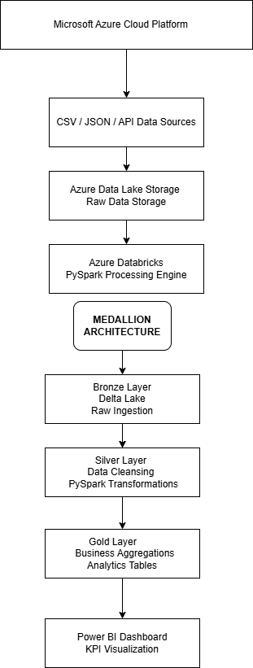
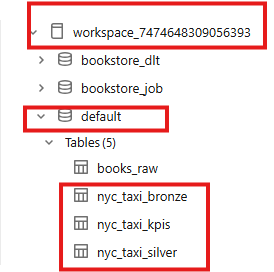
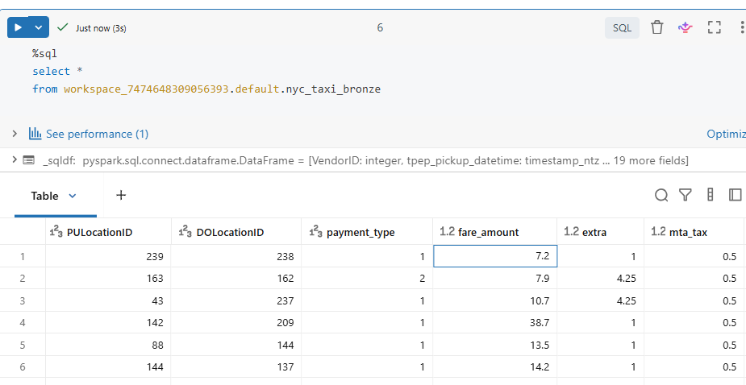
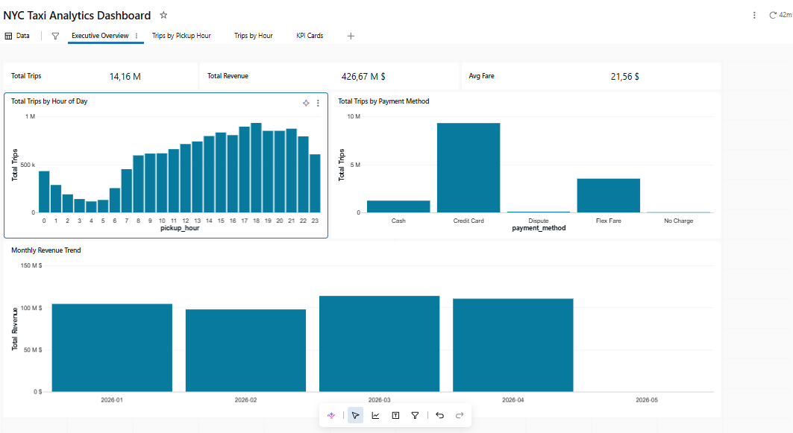

# Modern Data Platform with Databricks and Delta Lake


---

# Project Overview

This project implements a modern Lakehouse Data Platform using Databricks, Apache Spark, Delta Lake and Medallion Architecture.

The platform ingests real-world NYC Yellow Taxi trip records in Parquet format, processes them through Bronze, Silver and Gold layers, and produces analytics-ready datasets for business intelligence and reporting.

The dataset is based on official NYC Taxi & Limousine Commission trip records.

---

# Architecture



---

# Databricks Execution Evidence

## Unity Catalog Tables

The pipeline was executed in Databricks using Unity Catalog managed Delta tables.



Created tables:

* nyc_taxi_bronze
* nyc_taxi_silver
* nyc_taxi_kpis

---

## Gold KPI Table

The Gold layer generates analytics-ready KPI tables from more than 14 million NYC Taxi records.




---

# Project Scale

| Metric            | Value                  |
| ----------------- | ---------------------- |
| Records processed | 14,163,317             |
| Source format     | Parquet                |
| Storage format    | Delta Lake             |
| Processing engine | Apache Spark           |
| Platform          | Databricks             |
| Governance        | Unity Catalog          |
| Architecture      | Bronze / Silver / Gold |

---

# Medallion Architecture

## Bronze Layer

* Raw data ingestion
* Delta Lake storage
* Historical raw data preservation

## Silver Layer

* Data cleansing
* Standardization
* Deduplication
* PySpark transformations

## Gold Layer

* Business aggregations
* KPI generation
* Analytics-ready tables

---

# Technology Stack

| Technology            | Purpose                |
| --------------------- | ---------------------- |
| Unity Catalog Volumes | Raw data storage       |
| Databricks            | Distributed processing |
| PySpark               | Data transformation    |
| Delta Lake            | ACID transactions      |
| Unity Catalog         | Data governance        |
| Power BI              | Reporting & dashboards |

---

# Business Use Case

The project simulates a real-world transportation analytics platform based on NYC Yellow Taxi trip data.

Main objectives:

* Ingest large-scale Parquet taxi trip records
* Store raw data in Delta Lake Bronze tables
* Clean and standardize trip data in Silver tables
* Generate Gold analytics tables for KPIs
* Analyze revenue, trip volume, distance, tips and payment behavior

---

# Features

* Incremental data ingestion
* Delta Lake tables
* Medallion Architecture
* PySpark transformations
* Business KPI generation
* Data quality checks
* Unity Catalog governance
* Scalable cloud architecture

---

# Project Structure

```text
modern-data-platform-databricks/
│
├── architecture/
├── datasets/
├── docs/
├── images/
├── notebooks/
├── README.md
└── requirements.txt
```

---

# Sample KPIs

Examples of generated KPIs:

* Total trips
* Total revenue
* Average fare amount
* Average trip distance
* Average tip amount
* Trips by pickup hour
* Trips by payment type
* Monthly revenue trends

---

# Spark Optimization

This project includes several Spark optimization techniques:

* Partitioning
* Delta Lake optimization
* Efficient transformations
* Optimized joins
* Scalable processing patterns

---

# Future Improvements

* Power BI dashboard integration
* Auto Loader ingestion
* Streaming pipelines
* CI/CD integration
* dbt integration
* Terraform deployment
* Real-time analytics

---
---

## Analytics Dashboard

The Gold layer feeds a Databricks SQL Dashboard used for business analytics and KPI monitoring.



Dashboard metrics include:

- Total Trips
- Total Revenue
- Average Fare
- Trips by Hour of Day
- Trips by Payment Method
- Monthly Revenue Trend

# Author

Djamel Guerchouche

Senior Data Engineer specialized in:

* Databricks
* Apache Spark
* Delta Lake
* Azure
* Enterprise Data Platforms
