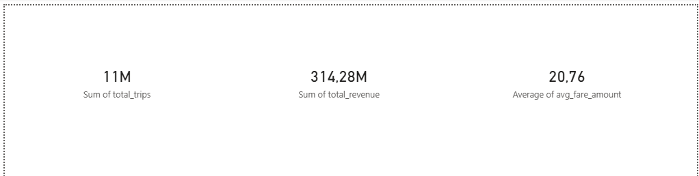
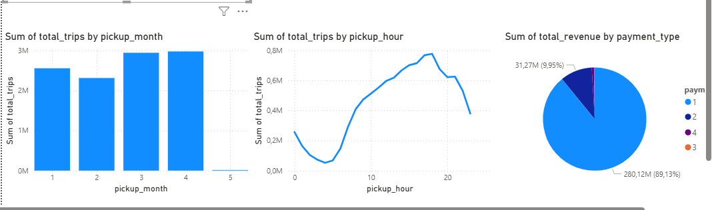

# Modern Data Platform with Databricks & Delta Lake

[](https://databricks.com)
[](https://spark.apache.org)
[](https://delta.io)
[](https://databricks.com/product/unity-catalog)
[](https://powerbi.microsoft.com)
[](https://aws.amazon.com)
[](LICENSE)

End-to-end cloud Lakehouse platform built on AWS Databricks, processing **14.9M+ NYC Taxi records** through a Medallion Architecture with Delta Lake, Unity Catalog Volumes, and Power BI.

---

## Table of Contents

- [Overview](#overview)
- [Architecture](#architecture)
- [Getting Started](#getting-started)
- [Medallion Architecture](#medallion-architecture)
- [Technology Stack](#technology-stack)
- [Project Scale](#project-scale)
- [Pipeline Execution Results](#pipeline-execution-results)
- [Power BI Dashboard](#power-bi-dashboard)
- [Spark Optimization](#spark-optimization)
- [Business Use Case](#business-use-case)
- [Project Structure](#project-structure)
- [Future Improvements](#future-improvements)
- [Author](#author)

---

## Overview

This project implements a production-grade Lakehouse Data Platform on AWS Databricks.

It ingests real-world **NYC Yellow Taxi trip records** (January to April 2026) in Parquet format from a **Unity Catalog Volume**, processes them through Bronze, Silver, and Gold layers using PySpark and Delta Lake, and exposes analytics-ready KPI datasets via a **Power BI dashboard** connected in DirectQuery mode.

The dataset is sourced from the official NYC Taxi & Limousine Commission (TLC) trip records.

---

## Architecture

The platform follows a layered Lakehouse architecture:

- **Ingestion** — Parquet files uploaded to Unity Catalog Volume (`/Volumes/nyc_taxi/taxi/nyc_taxi_data/`)
- **Bronze** — Raw data persisted as Delta tables in Unity Catalog, no transformation
- **Silver** — Cleaned, filtered, and enriched data with derived time columns
- **Gold** — Business KPI aggregations ready for analytics
- **Serving** — Power BI Dashboard connected via DirectQuery on Gold table

---

## Getting Started

### Prerequisites

- An **AWS Databricks workspace** with Unity Catalog enabled
- A cluster with **Databricks Runtime 13.0+** (includes Delta Lake and PySpark)
- **Power BI Desktop** installed (for the dashboard)

### 1. Download the Dataset

The project uses **NYC Yellow Taxi trip records** (official public dataset).

👉 Download Parquet files from the NYC TLC website:
**https://www.nyc.gov/site/tlc/about/tlc-trip-record-data.page**

Select: **Yellow Taxi Trip Records** → Year **2026** → Download monthly `.parquet` files (January to April).

### 2. Create Unity Catalog Structure

In your Databricks workspace, create the following structure:

```sql
CREATE CATALOG IF NOT EXISTS nyc_taxi;
CREATE SCHEMA IF NOT EXISTS nyc_taxi.taxi;
CREATE VOLUME IF NOT EXISTS nyc_taxi.taxi.nyc_taxi_data;
```

### 3. Upload Data to the Volume

In your Databricks workspace:
1. Go to **Catalog** → **nyc_taxi** → **taxi** → **nyc_taxi_data**
2. Click **Upload to this volume**
3. Upload your 4 Parquet files

Your volume path will be: `/Volumes/nyc_taxi/taxi/nyc_taxi_data/`

### 4. Import the Notebooks

In your Databricks workspace:
1. Go to **Workspace** → **Repos** → **Add Repo**
2. Enter: `https://github.com/djguerch-ops/modern-data-platform-databricks`
3. Click **Create Repo**

### 5. Run the Notebooks in Order

| Step | Notebook | Description |
|------|----------|-------------|
| 1 | `01_bronze_nyc_taxi_ingestion.py` | Ingests Parquet files from Volume into Bronze Delta table |
| 2 | `silver_nyc_taxi_transformations.py` | Cleans, filters, and enriches Bronze data |
| 3 | `gold_nyc_taxi_kpis.py` | Aggregates Silver data into KPI Gold table |

### 6. Connect Power BI

1. Open **Power BI Desktop** → **Get Data** → **Databricks**
2. Enter your **Server hostname** and **HTTP Path** (from SQL Warehouses → Connection details)
3. Choose **DirectQuery** mode
4. Authenticate with a **Personal Access Token**
5. Select the table `nyc_taxi.taxi.nyc_taxi_kpis`

---

## Medallion Architecture

### Bronze Layer

- Raw ingestion of NYC Taxi Parquet files from Unity Catalog Volume
- Stored as Delta Lake managed table: `nyc_taxi.taxi.nyc_taxi_bronze`
- Full historical preservation — no data loss
- Metadata columns added: `ingestion_timestamp`, `source_file`
- Schema merging enabled for multi-file ingestion

### Silver Layer

- Data quality filtering:
  - `trip_distance` between 0 and 200
  - `fare_amount` between 0 and 500
  - `passenger_count` between 1 and 6
  - No null timestamps
  - Year filtered to 2026 only (removes aberrant historical records)
- Timestamp standardization: `pickup_timestamp`, `dropoff_timestamp`
- Derived time columns: `pickup_hour`, `pickup_day_of_week`, `pickup_month`, `pickup_year`
- Deduplication via `dropDuplicates()`
- Stored as: `nyc_taxi.taxi.nyc_taxi_silver`

### Gold Layer

- Business-level KPI aggregations grouped by: `pickup_year`, `pickup_month`, `pickup_hour`, `pickup_day_of_week`, `payment_type`
- Metrics computed: `total_trips`, `total_revenue`, `avg_fare_amount`, `avg_trip_distance`, `avg_tip_amount`, `avg_passenger_count`
- Stored as: `nyc_taxi.taxi.nyc_taxi_kpis`
- Powers the Power BI dashboard via DirectQuery

---

## Technology Stack

| Technology              | Role                                      |
| ----------------------- | ----------------------------------------- |
| AWS Databricks          | Distributed processing & orchestration    |
| Apache Spark / PySpark  | Data transformation at scale              |
| Delta Lake              | ACID transactions & time travel           |
| Unity Catalog           | Data governance, access control & lineage |
| Unity Catalog Volumes   | Raw file storage (landing zone)           |
| Power BI                | Business dashboard (DirectQuery)          |

---

## Project Scale

| Metric              | Value                        |
| ------------------- | ---------------------------- |
| Source period       | January → April 2026         |
| Bronze records      | 14,908,446                   |
| Silver records      | 10,771,325                   |
| Rejected records    | 4,137,121 (27.8%)            |
| Gold KPI rows       | 2,689                        |
| Source format       | Parquet                      |
| Storage format      | Delta Lake                   |
| Processing engine   | Apache Spark                 |
| Platform            | AWS Databricks               |
| Governance          | Unity Catalog                |
| Architecture        | Bronze / Silver / Gold       |

---

## Pipeline Execution Results

### Bronze Layer
```
Reading Parquet files from: /Volumes/nyc_taxi/taxi/nyc_taxi_data/*.parquet
Raw records read: 14,908,446
Bronze ingestion completed successfully.
Total records in Bronze table: 14,908,446
Table location: nyc_taxi.taxi.nyc_taxi_bronze
```

### Silver Layer
```
Reading Bronze table: nyc_taxi.taxi.nyc_taxi_bronze
Bronze records: 14,908,446
Silver transformation completed successfully.
Bronze records  : 14,908,446
Silver records  : 10,771,325
Rejected records: 4,137,121 (27.8%)
Table location  : nyc_taxi.taxi.nyc_taxi_silver
```

### Gold Layer
```
Reading Silver table: nyc_taxi.taxi.nyc_taxi_silver
Silver records: 10,771,325
Gold KPI table created successfully.
Total KPI rows  : 2,689
Table location  : nyc_taxi.taxi.nyc_taxi_kpis
```

---

## Power BI Dashboard

The Gold table `nyc_taxi.taxi.nyc_taxi_kpis` is connected to Power BI Desktop via **DirectQuery** using the Databricks SQL connector.

### KPI Cards



| KPI | Value |
|-----|-------|
| Total Trips | 11M |
| Total Revenue | $314.28M |
| Average Fare Amount | $20.76 |

### Charts



- **Trips by Month** — March and April are the busiest months
- **Trips by Hour** — Peak traffic at 8-9am and 18-19pm
- **Revenue by Payment Type** — Credit card dominates at 89.13%

---

## Spark Optimization

| Technique                  | Implementation                                      |
| -------------------------- | --------------------------------------------------- |
| Delta Lake                 | ACID transactions, time travel, optimized reads     |
| Schema merging             | `mergeSchema=true` for multi-file Parquet ingestion |
| Predicate pushdown         | Filters applied before joins and aggregations       |
| Partition pruning          | Year filter on Silver reduces data scanned          |
| Avoid wide transformations | Minimized shuffles, aggregations pushed to Gold     |

---

## Business Use Case

The platform simulates a real-world **transportation analytics system** for NYC Yellow Taxi operations.

**Key objectives:**
- Ingest large-scale Parquet trip records at scale via Unity Catalog Volumes
- Preserve raw data in Bronze for full auditability
- Clean and standardize trip records in Silver with data quality rules
- Generate Gold-level KPIs for business decision-making
- Visualize insights via Power BI in DirectQuery mode

**KPIs generated:**
- Total trips and monthly trends (Jan → Apr 2026)
- Total revenue and average fare amount
- Trip distribution by hour of day and day of week
- Revenue breakdown by payment type
- Average trip distance and tip rate

---

## Project Structure

```
modern-data-platform-databricks/
│
├── Images/                  # Dashboard screenshots
│   ├── cards.png            # KPI Cards (Power BI)
│   └── bar_chart.png        # Charts (Power BI)
│
├── Notebooks/               # Databricks notebooks
│   ├── 01_bronze_nyc_taxi_ingestion.py
│   ├── silver_nyc_taxi_transformations.py
│   └── gold_nyc_taxi_kpis.py
│
├── architecture/            # Architecture diagrams
├── datasets/                # Data references (see Getting Started)
├── .gitignore
├── LICENSE
└── README.md
```

---

## Future Improvements

- [ ] Auto Loader for incremental ingestion from Unity Catalog Volumes
- [ ] CI/CD pipeline with GitHub Actions + Databricks Asset Bundles
- [ ] dbt integration for SQL-based transformations on Gold layer
- [ ] Terraform deployment for infrastructure as code (IaC)
- [ ] Real-time streaming pipeline with Databricks Structured Streaming
- [ ] Data quality framework with Databricks Data Quality
- [ ] End-to-end monitoring with Databricks Lakehouse Monitoring
- [ ] Publish Power BI report to Power BI Service

---

## Author

**Djamel Guerchouche**
Data Engineer

Specialized in cloud-native data platforms, distributed processing, and Lakehouse architecture.

- 🔗 [LinkedIn](https://www.linkedin.com/in/djamel-guerchouche-863559b6/)
- 🐙 [GitHub](https://github.com/djguerch-ops)

**Core expertise:**
AWS · Databricks · Apache Spark · Delta Lake · Unity Catalog · Python · Power BI

---

*Built with ❤️ using AWS Databricks, PySpark, Delta Lake and Power BI.*
